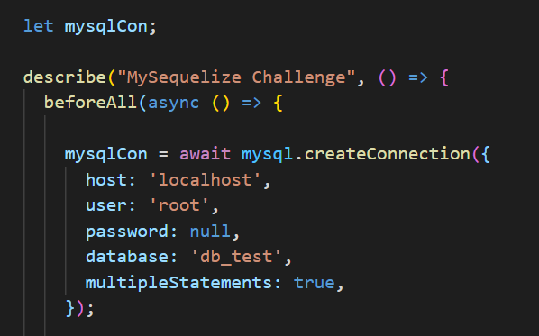

# Challenge-Sequelize

## Description

In this challenge we will be building basic ORM functionallity base on Sequelize usin mysql2

--- 

## Main Goal

Implementing the next functions: 

* Insert ()

* BulkInsert ()

* FindAll ()

* FindOne ()

* FindByPk ()

* Update ()

* soft/hard Destroy ()

* Restore ()

---
 
## First Steps

1. Clone template repository

2. Run ``` $npm i ```

3. If you want to run the tests locally, connect to your MySql in the [test connection statment](./test.test.js), which is located in the ``` beforeAll() ``` in the main test.



--- 

## Starting The Challenge


### If you are not famillier with SQL syntax:

#### SQL Queries
* [SQL Syntax Tutorial] (https://www.sqltutorial.org/)
* [SQL SELECT Statement] (https://www.sqltutorial.org/sql-select/)
* [SQL WHERE] (https://www.sqltutorial.org/sql-where/)
* [SQL ORDER BY] (https://www.sqltutorial.org/sql-order-by/)
* [SQL LIMIT] (https://www.sqltutorial.org/sql-limit/)
* [SQL INSERT] (https://www.sqltutorial.org/sql-insert/)
* [SQL UPDATE] (https://www.sqltutorial.org/sql-update/)
* [SQL DELETE] (https://www.sqltutorial.org/sql-delete/)


### If you are not famillier with Sequelize syntax:

* ``` Model.Insert({... the object containing the value you want to insert}) ``` [sequelize create reference](https://sequelize.org/master/manual/model-querying-basics.html#simple-insert-queries)

* ``` Model.BulkInsert([... array with the objects  you want to insert]) ``` [sequelize bulk create reference](https://sequelize.org/master/manual/model-querying-basics.html#creating-in-bulk)

* ``` Model.findAll({ ```
     ```... the object containing the select query condition you want to apply}) ``` [sequelize findAll reference](https://sequelize.org/master/manual/model-querying-basics.html#simple-select-queries)

* ``` Model.FindOne({... the object containing the select query condition you want to apply}) ``` [sequelize findOne reference](https://sequelize.org/master/manual/model-querying-finders.html#-code-findone--code-) 

* ``` Model.FindByPk(Priority Key) ```   [sequelize findByPk reference](https://sequelize.org/master/manual/model-querying-finders.html#-code-findbypk--code-)

* ``` Model.Update({... the object containing the where condition, that you want to update}) ``` [sequelize updete reference](https://sequelize.org/master/manual/model-querying-basics.html#simple-update-queries)

* soft/hard Destroy: ``` Model.Destroy ({... the object containing the conditions for the rows that you want to delete, to hard delete add force:true}) ``` [sequelize destroy reference](https://sequelize.org/master/manual/model-querying-basics.html#simple-delete-queries), [sequelize paranoid reference](https://sequelize.org/master/manual/paranoid.html)

* ``` Model.Restor ({... the object containing the conditions for the rows that you want to restore}, without object restor all) ```  [sequelize restor reference](https://sequelize.org/master/manual/paranoid.html#restoring), [sequelize paranoid reference](https://sequelize.org/master/manual/paranoid.html)

---


## Submiting The Challenge

---

## Usefull Links

## Usefull Links


